# symspell_rs v7.0.1 - 3x faster lookup, 40% less memory consumption, 11x faster Damerau-Levenshtein edit distance.

There have been both significant implementation changes to SymSpell as well as algorithmic changes to the Damerau-Levenshtein calculation between v6.8.4 vs. v7.0.1.  
The resulting performance improvements are measured with the **new benchmark suite** and discussed below.

## Changes

### Improved Damerau-Levenshtein calculation, optimal string alignment (OSA) variant

- Optimized SymSpell v7.0.1 `damerau_levenshtein_osa` by using **bit-parallel OSA ([Hyyrö 2003](https://www.sciencedirect.com/science/article/pii/S157086670400053X/pdf))**, making it **11x faster** than SymSpell v6.8.4 `damerau_levenshtein_osa`.
- Optimized SymSpell v7.0.1 `damerau_levenshtein_osa_fallback` by using the **multi-word block version** of the **bit-parallel OSA ([Hyyrö 2003](https://www.sciencedirect.com/science/article/pii/S157086670400053X/pdf))**, to cover any length., making it **7x faster** than than SymSpell v6.8.4 `damerau_levenshtein_osa` for terms > 64 chars.
- Exposed `damerau_levenshtein_osa` as a public method for standalone use.

### Improved SymSpell implementation: internal storage, allocation free, shared term table, lightweight hasher

- Internal storage: `words` now maps terms to ids, and counts live in a new term table. Serialized dictionaries from previous versions (`serde` feature) are not compatible.
- The derived `PartialEq` on `SymSpell` compares term ids, so dictionaries with the same content but a different insertion order compare unequal.
- ASCII input now takes an allocation-free fast path: stack-based candidates, borrowed hits, and `Suggestion` strings created only for the returned results (after sort and `max_results`). Non-ASCII input uses a char-based path that shares the same verification code.
- Delete buckets store compact 8-byte entries (term id, length, ASCII flag) that refer to a shared term table, instead of a heap copy of the term per delete. This lowers memory use and removes pointer chasing.
- The `deletes` map uses a lightweight hasher, since its keys are already 32-bit hashes.

## Verbose Benchmark setup

- Benchmark harness: [divan](https://github.com/nvzqz/divan) with a tracking global allocator. Results below are the figures printed to stderr by the benchmark.
- 81 lookup experiments per version: English frequency dictionaries with 30k, 82k and 500k entries × `prefix_length` 5, 6, 7 × maximum edit distance 1, 2, 3 × `Verbosity` Top, Closest, All. The dictionary is rebuilt for each maximum edit distance (maximum dictionary edit distance = maximum edit distance), which gives 27 dictionary builds per version.
- **Average latency** = average time per `lookup()` call. **Speedup** = latency of v6.8.4 ÷ latency of current (higher is better).
- **Build time** = time to build the dictionary. **Resident memory** = resident memory after the build. **Peak memory** = maximum memory consumption during the build.
- Charts use a logarithmic y-axis where values span orders of magnitude (latency, build memory across dictionary sizes).
- **Verbose benchmark** based on [divan](https://github.com/nvzqz/divan): `cargo bench --bench verbose  --features gxhash`

## Basic benchmark setup 
  - Lookup latency experiments (162 in total): the 30k, 82k and 500k English frequency dictionaries × `prefix_length` 5, 6, 7 × maximum edit distance 1, 2, 3 × `Verbosity` Top, Closest, All × {this version, [symspell_rs 6.8.4](https://crates.io/crates/symspell_rs/6.8.4)}.
  - Load dictionary time experiments (27 in total): the 30k, 82k and 500k English frequency dictionaries × `prefix_length` 5, 6, 7 × maximum edit distance 1, 2, 3
  - Damerau-Levenshtein OSA latency experiments (6 in total): maximum edit distance 1, 2, 3 x bit-parallel OSA, multi-word block bit-parallel OSA
  - **Basic benchmark**: `cargo bench --bench basic --features gxhash` 

### Test data

#### noisy_query_en_1000.txt

For the query we use the first 1000 unique words. from Norvig’s text corpus [big.txt](http://norvig.com/big.txt).

For each word a random number of edits in the range 0..Min(word.length/2 , 4) is chosen. For each edit a random type of edit (delete, insert random char, replace with random char, switch adjacent chars) is applied at a random position within the word. After the edits no duplicates and words with length<2 are allowed.

**frequency_dictionary_en_30_000.txt**

These are the 29,159 unique words from Norvig’s text corpus [big.txt](http://norvig.com/big.txt), together with their frequency in that corpus. 

**frequency_dictionary_en_82_765.txt**

The frequency_dictionary_en_82_765.txt was created by intersecting the two lists mentioned below. By reciprocally filtering only those words which appear in both lists are used. Additional filters were applied and the resulting list truncated to ≈ 80,000 most frequent words.

- [Google Books Ngram data](http://storage.googleapis.com/books/ngrams/books/datasetsv2.html) [(License)](https://creativecommons.org/licenses/by/3.0/) : Provides representative word frequencies
- [SCOWL - Spell Checker Oriented Word Lists](http://wordlist.aspell.net/) [(License)](http://wordlist.aspell.net/scowl-readme/) : Ensures genuine English vocabulary

**frequency_dictionary_en_500_000.txt**

These are the most frequent 500,000 words from the English One Million list from [Google Books Ngram data](http://storage.googleapis.com/books/ngrams/books/datasetsv2.html), together with their frequency.

All three test data files are released on GitHub.

## Summary: what improved in the new version

- **Faster Damerau-Levenshtein calculation**, (optimal string alignment (OSA) variant). All 3 Damerau-Levenshtein experiments are faster, by a geometric mean of **10.9×** (range 10.0× to 12.2×).
  - `damerau_levenshtein_osa` using **bit-parallel OSA ([Hyyrö 2003](https://www.sciencedirect.com/science/article/pii/S157086670400053X/pdf))** (length <= 64 chars): 14.9x on average (10.0× to 12.2×)
  - `damerau_levenshtein_osa_fallback` using the **multi-word block version** of the **bit-parallel algorithm ([Hyyrö 2003](https://www.sciencedirect.com/science/article/pii/S157086670400053X/pdf))** (any length): 6.9x faster on average (6.7x to 8.0x)
  - max edit distance 1: 12.2× (OSA), 8.0 (OSA fallback)
  - max edit distance 2: 10.6× (OSA), 6.2 (OSA fallback)
  - max edit distance 3: 10.0× (OSA), 6.7 (OSA fallback)
- **Faster lookups in every experiment.** All 81 lookup experiments are faster, by a geometric mean of **2.8×** (range 1.5× to 5.9×).
  - `Verbosity::Top`: 3.0× on average (1.8× to 5.9×)
  - `Verbosity::Closest`: 2.9× on average (1.5× to 4.2×)
  - `Verbosity::All`: 2.7× on average (1.6× to 4.8×)
  - max edit distance 1: 2.4× on average (1.5× to 3.7×)
  - max edit distance 2: 2.8× on average (2.1× to 5.2×)
  - max edit distance 3: 3.4× on average (1.8× to 5.9×)
  - 30,000-word dictionary: 2.9× on average (1.5× to 4.8×)
  - 82,765-word dictionary: 3.0× on average (1.8× to 5.9×)
  - 500,000-word dictionary: 2.6× on average (1.6× to 3.5×)
- **Much lower memory use during lookups.** Peak heap allocation per lookup is on average only **31%** of v6.8.4 (best case 17%, worst case 77%).
  - `Verbosity::Top`: 18% of v6.8.4 on average (17% to 18%)
  - `Verbosity::Closest`: 32% of v6.8.4 on average (18% to 73%)
  - `Verbosity::All`: 52% of v6.8.4 on average (33% to 77%)
- **Roughly 40% less memory for the dictionary.** Resident memory after the build is on average **62%** of v6.8.4 (best case 48%, worst case 83%). Peak memory during the build is on average **64%** of v6.8.4 (48% to 88%).
  - Largest example, 500k dictionary, prefix 7, edit distance 3: resident memory 874 MiB → 436 MiB, peak 874 MiB → 436 MiB, build time 14.20 s → 12.60 s.
- **Build time is on par or slightly better.** On average the build is 1.09× as fast as v6.8.4 (range 0.86× to 1.58×). 6 of 27 builds are marginally slower (at most 17%), so the memory savings come at no real build-time cost.

### 💡 The interesting part: 
In the first step, we improved the Damerau-Levenshtein calculation only, while letting the SymSpell implementation unchanged.
An **11x faster edit distance** gave only a **20% speedup for SymSpell**. That told us two things:
1️⃣ SymSpell's makes spelling correction latency largely independent of raw edit distance performance. The symmetric delete algorithm already avoids most of that work. 
2️⃣ Further performance gains had to come from SeekStorm implementation improvements rather than edit distance calculation optimization. We did, and achieved **300% speedup for SymSpell**.

## Damerau-Levenshtein (OSA) latency

- strsim v0.11.1 **osa_distance** uses a vanilla implementation of the Damerau-Levenshtein algorithm.
- SymSpell v6.8.4 **damerau_levenshtein_osa** uses a vanilla implementation of the Damerau-Levenshtein algorithm.
- SymSpell v7.0.1 **damerau_levenshtein_osa** uses **bit-parallel OSA ([Hyyrö 2003](https://www.sciencedirect.com/science/article/pii/S157086670400053X/pdf))** (length <= 64 chars)
- SymSpell v7.0.1 **damerau_levenshtein_osa_fallback** uses **multi-word block version** of the **bit-parallel OSA ([Hyyrö 2003](https://www.sciencedirect.com/science/article/pii/S157086670400053X/pdf))** (any length)

| max edit distance | SymSpell v6.8.4 damerau_levenshtein_osa | SymSpell v7.0.1 damerau_levenshtein_osa | speedup |
|---:|---:|---:|---:|
| 1 | 173 ns | 14 ns | 12.18× |
| 2 | 170 ns | 16 ns | 10.63× |
| 3 | 178 ns | 17 ns | 10.04× |

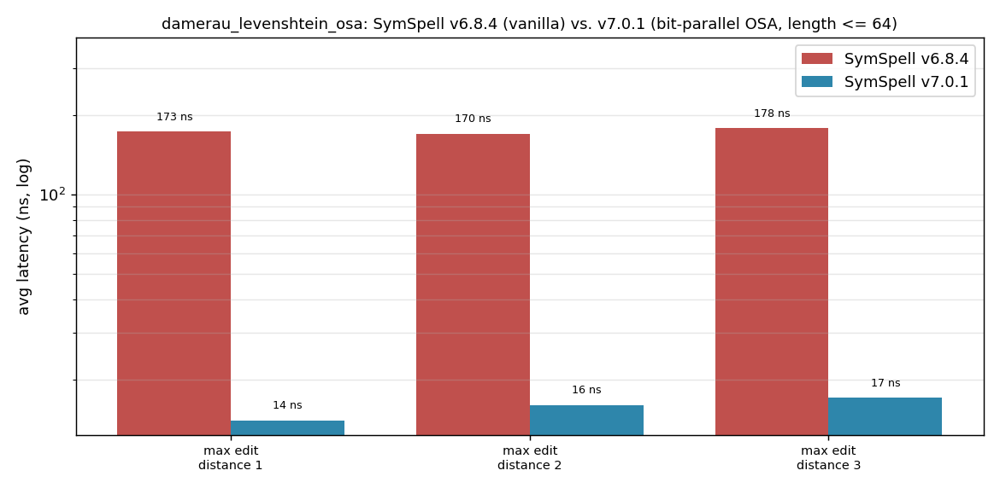

---

| max edit distance | [strsim v0.11.1](https://github.com/rapidfuzz/strsim-rs) osa_distance | [SymSpell v7.0.1](https://github.com/wolfgarbe/symspell_rs/) damerau_levenshtein_osa | speedup |
|---:|---:|---:|---:|
| 1 | 169 ns | 14 ns | 11.89× |
| 2 | 180 ns | 16 ns | 11.28× |
| 3 | 181 ns | 17 ns | 10.22× |

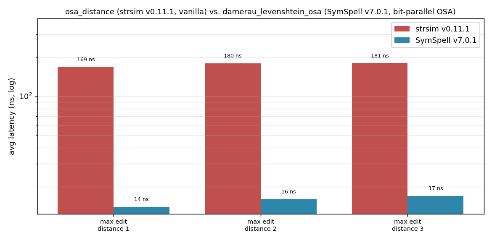

---

| max edit distance | SymSpell v6.8.4 damerau_levenshtein_osa | SymSpell v7.0.1 damerau_levenshtein_osa_fallback | speedup |
|---:|---:|---:|---:|
| 1 | 173 ns | 21 ns | 7.99× |
| 2 | 170 ns | 27 ns | 6.17× |
| 3 | 178 ns | 26 ns | 6.67× |

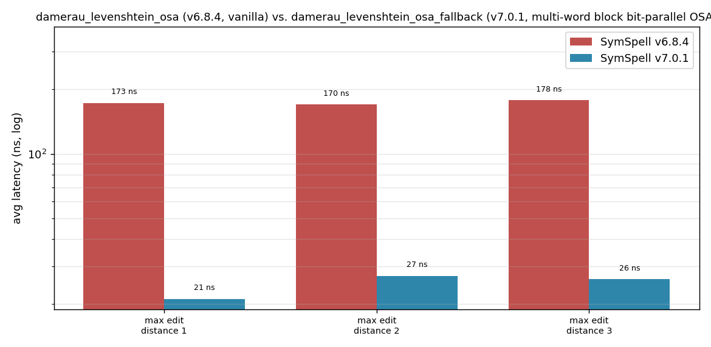

*Using noisy_query_en_1000.txt, calculation the edit distance between misspelled_string and corrected_string, for the given maximum edit distance.*

## Lookup latency

### 30,000-word dictionary

#### 30,000 words, `Verbosity::Top`

| max edit distance | prefix length | v6.8.4 | current | speedup |
|---:|---:|---:|---:|---:|
| 1 | 5 | 3.41 µs | 1.27 µs | 2.69× |
| 1 | 6 | 2.84 µs | 1.28 µs | 2.22× |
| 1 | 7 | 2.38 µs | 1.12 µs | 2.12× |
| 2 | 5 | 23.1 µs | 6.63 µs | 3.48× |
| 2 | 6 | 12.6 µs | 4.40 µs | 2.86× |
| 2 | 7 | 9.67 µs | 3.17 µs | 3.05× |
| 3 | 5 | 91.7 µs | 21.3 µs | 4.31× |
| 3 | 6 | 38.3 µs | 9.54 µs | 4.01× |
| 3 | 7 | 31.9 µs | 6.70 µs | 4.76× |

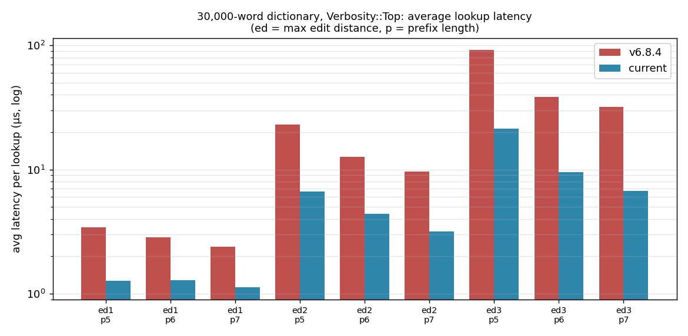

#### 30,000 words, `Verbosity::Closest`

| max edit distance | prefix length | v6.8.4 | current | speedup |
|---:|---:|---:|---:|---:|
| 1 | 5 | 3.17 µs | 1.22 µs | 2.60× |
| 1 | 6 | 3.53 µs | 1.27 µs | 2.78× |
| 1 | 7 | 1.98 µs | 1.31 µs | 1.51× |
| 2 | 5 | 22.2 µs | 6.98 µs | 3.18× |
| 2 | 6 | 12.0 µs | 4.53 µs | 2.66× |
| 2 | 7 | 8.50 µs | 3.70 µs | 2.30× |
| 3 | 5 | 91.1 µs | 21.8 µs | 4.18× |
| 3 | 6 | 38.3 µs | 10.2 µs | 3.75× |
| 3 | 7 | 23.2 µs | 7.05 µs | 3.29× |

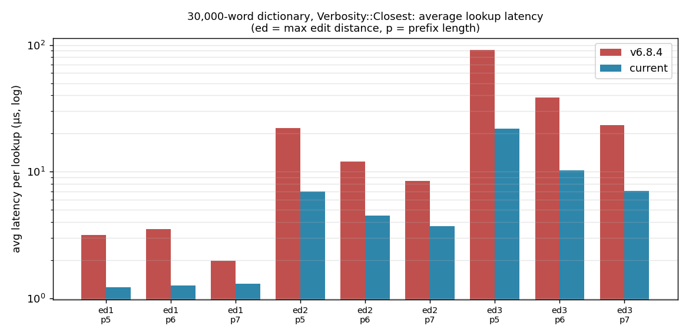

#### 30,000 words, `Verbosity::All`

| max edit distance | prefix length | v6.8.4 | current | speedup |
|---:|---:|---:|---:|---:|
| 1 | 5 | 5.97 µs | 2.16 µs | 2.76× |
| 1 | 6 | 5.20 µs | 2.15 µs | 2.42× |
| 1 | 7 | 5.07 µs | 2.03 µs | 2.50× |
| 2 | 5 | 91.3 µs | 30.0 µs | 3.04× |
| 2 | 6 | 55.2 µs | 18.6 µs | 2.96× |
| 2 | 7 | 40.3 µs | 19.1 µs | 2.11× |
| 3 | 5 | 941.9 µs | 265.5 µs | 3.55× |
| 3 | 6 | 452.4 µs | 136.7 µs | 3.31× |
| 3 | 7 | 431.0 µs | 177.1 µs | 2.43× |

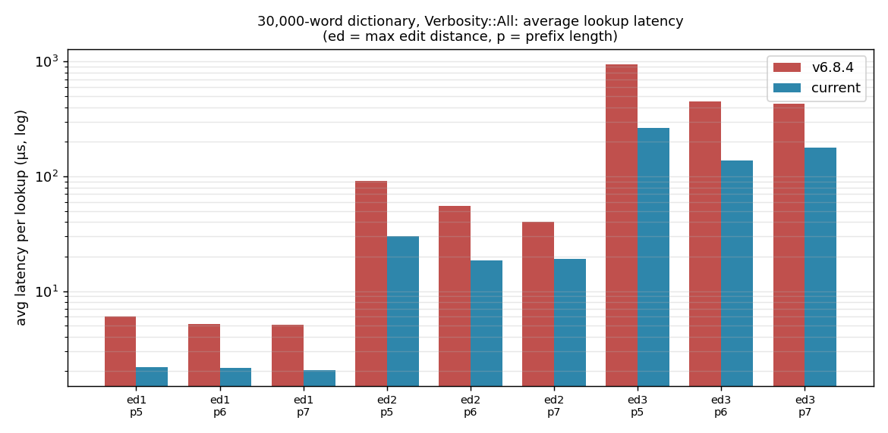

### 82,765-word dictionary

#### 82,765 words, `Verbosity::Top`

| max edit distance | prefix length | v6.8.4 | current | speedup |
|---:|---:|---:|---:|---:|
| 1 | 5 | 8.96 µs | 3.36 µs | 2.67× |
| 1 | 6 | 4.03 µs | 2.10 µs | 1.92× |
| 1 | 7 | 5.32 µs | 1.42 µs | 3.75× |
| 2 | 5 | 55.3 µs | 24.4 µs | 2.27× |
| 2 | 6 | 38.3 µs | 7.40 µs | 5.17× |
| 2 | 7 | 28.1 µs | 7.39 µs | 3.80× |
| 3 | 5 | 319.4 µs | 54.6 µs | 5.85× |
| 3 | 6 | 139.1 µs | 32.0 µs | 4.35× |
| 3 | 7 | 39.4 µs | 21.6 µs | 1.83× |

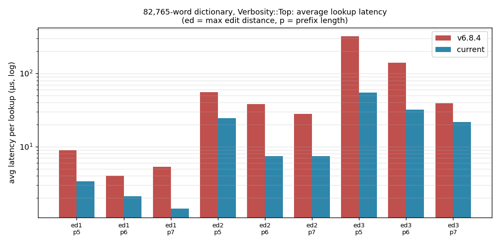

#### 82,765 words, `Verbosity::Closest`

| max edit distance | prefix length | v6.8.4 | current | speedup |
|---:|---:|---:|---:|---:|
| 1 | 5 | 6.28 µs | 2.40 µs | 2.62× |
| 1 | 6 | 5.60 µs | 1.74 µs | 3.22× |
| 1 | 7 | 6.39 µs | 1.74 µs | 3.67× |
| 2 | 5 | 55.4 µs | 23.9 µs | 2.32× |
| 2 | 6 | 29.9 µs | 10.2 µs | 2.93× |
| 2 | 7 | 18.4 µs | 7.88 µs | 2.34× |
| 3 | 5 | 315.8 µs | 89.0 µs | 3.55× |
| 3 | 6 | 86.2 µs | 21.3 µs | 4.04× |
| 3 | 7 | 65.4 µs | 21.3 µs | 3.07× |

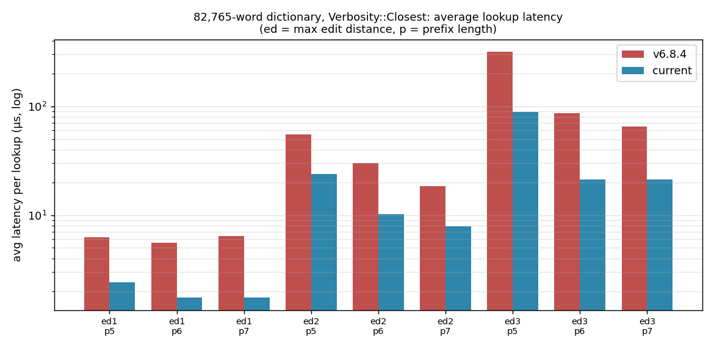

#### 82,765 words, `Verbosity::All`

| max edit distance | prefix length | v6.8.4 | current | speedup |
|---:|---:|---:|---:|---:|
| 1 | 5 | 9.64 µs | 4.47 µs | 2.16× |
| 1 | 6 | 7.20 µs | 3.53 µs | 2.04× |
| 1 | 7 | 10.7 µs | 3.59 µs | 2.98× |
| 2 | 5 | 335.0 µs | 86.0 µs | 3.89× |
| 2 | 6 | 121.9 µs | 52.7 µs | 2.31× |
| 2 | 7 | 106.1 µs | 45.9 µs | 2.31× |
| 3 | 5 | 3.89 ms | 808.3 µs | 4.81× |
| 3 | 6 | 1.66 ms | 424.8 µs | 3.91× |
| 3 | 7 | 1.02 ms | 421.0 µs | 2.42× |

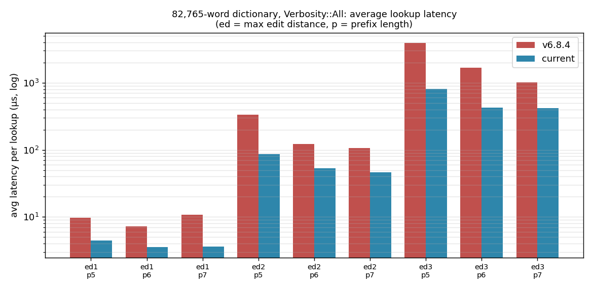

### 500,000-word dictionary

#### 500,000 words, `Verbosity::Top`

| max edit distance | prefix length | v6.8.4 | current | speedup |
|---:|---:|---:|---:|---:|
| 1 | 5 | 15.5 µs | 6.47 µs | 2.40× |
| 1 | 6 | 7.32 µs | 3.24 µs | 2.26× |
| 1 | 7 | 5.74 µs | 2.85 µs | 2.01× |
| 2 | 5 | 241.7 µs | 81.1 µs | 2.98× |
| 2 | 6 | 107.6 µs | 35.3 µs | 3.05× |
| 2 | 7 | 30.8 µs | 12.6 µs | 2.44× |
| 3 | 5 | 1.06 ms | 316.5 µs | 3.35× |
| 3 | 6 | 307.9 µs | 87.0 µs | 3.54× |
| 3 | 7 | 80.3 µs | 29.1 µs | 2.77× |

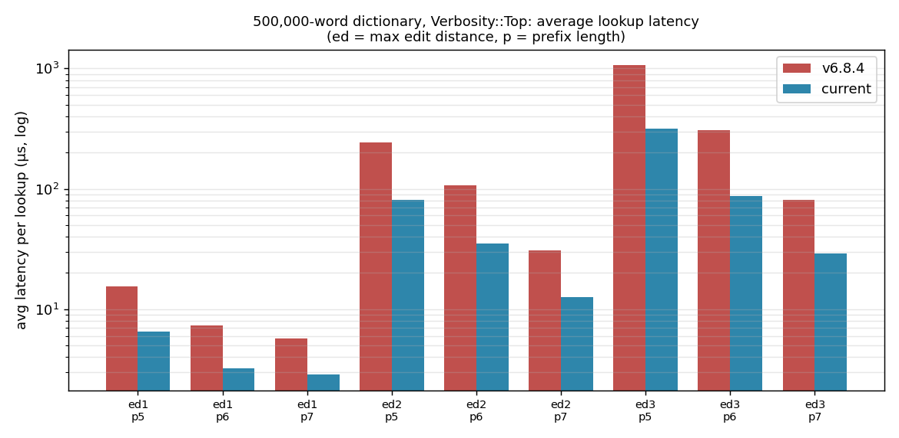

#### 500,000 words, `Verbosity::Closest`

| max edit distance | prefix length | v6.8.4 | current | speedup |
|---:|---:|---:|---:|---:|
| 1 | 5 | 16.4 µs | 6.79 µs | 2.42× |
| 1 | 6 | 13.1 µs | 3.77 µs | 3.49× |
| 1 | 7 | 5.72 µs | 3.15 µs | 1.82× |
| 2 | 5 | 243.6 µs | 90.5 µs | 2.69× |
| 2 | 6 | 66.3 µs | 25.0 µs | 2.66× |
| 2 | 7 | 36.8 µs | 13.2 µs | 2.79× |
| 3 | 5 | 1.07 ms | 302.0 µs | 3.54× |
| 3 | 6 | 348.2 µs | 103.7 µs | 3.36× |
| 3 | 7 | 79.0 µs | 30.3 µs | 2.61× |

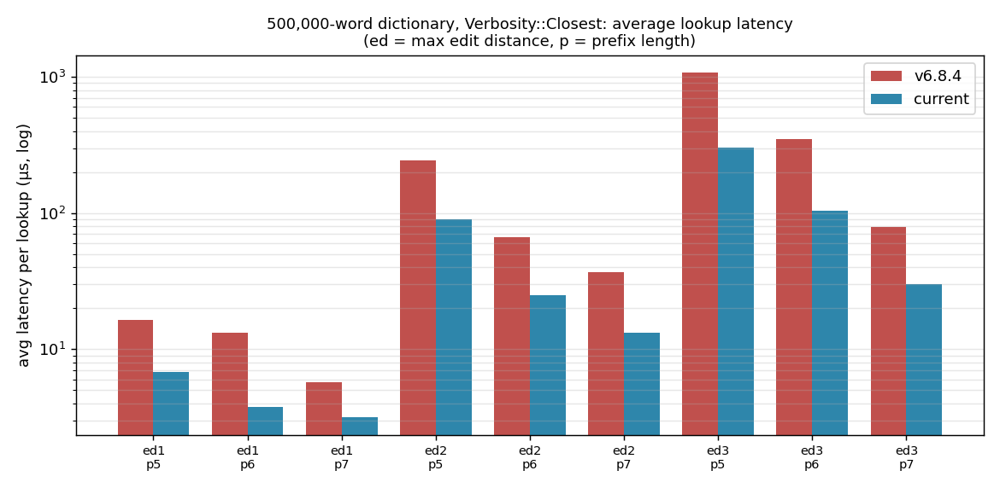

#### 500,000 words, `Verbosity::All`

| max edit distance | prefix length | v6.8.4 | current | speedup |
|---:|---:|---:|---:|---:|
| 1 | 5 | 72.3 µs | 22.0 µs | 3.28× |
| 1 | 6 | 29.0 µs | 18.4 µs | 1.57× |
| 1 | 7 | 27.9 µs | 16.2 µs | 1.72× |
| 2 | 5 | 1.84 ms | 677.9 µs | 2.71× |
| 2 | 6 | 1.02 ms | 415.8 µs | 2.45× |
| 2 | 7 | 990.3 µs | 406.6 µs | 2.44× |
| 3 | 5 | 25.48 ms | 9.25 ms | 2.75× |
| 3 | 6 | 10.93 ms | 3.85 ms | 2.84× |
| 3 | 7 | 9.66 ms | 4.12 ms | 2.34× |

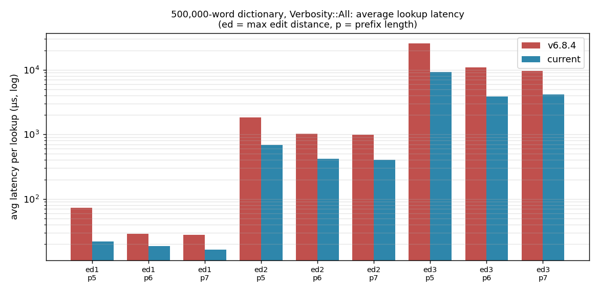

## Dictionary build

### Build time

| dictionary | prefix length | max dictionary edit distance | v6.8.4 | current | change |
|---|---:|---:|---:|---:|---:|
| 30,000 | 5 | 1 | 48 ms | 44 ms | 1.09× faster |
| 30,000 | 5 | 2 | 148 ms | 125 ms | 1.18× faster |
| 30,000 | 5 | 3 | 217 ms | 197 ms | 1.10× faster |
| 30,000 | 6 | 1 | 58 ms | 51 ms | 1.14× faster |
| 30,000 | 6 | 2 | 198 ms | 190 ms | 1.04× faster |
| 30,000 | 6 | 3 | 339 ms | 346 ms | 1.02× slower |
| 30,000 | 7 | 1 | 77 ms | 69 ms | 1.11× faster |
| 30,000 | 7 | 2 | 267 ms | 246 ms | 1.08× faster |
| 30,000 | 7 | 3 | 781 ms | 635 ms | 1.23× faster |
| 82,765 | 5 | 1 | 254 ms | 160 ms | 1.58× faster |
| 82,765 | 5 | 2 | 462 ms | 499 ms | 1.08× slower |
| 82,765 | 5 | 3 | 736 ms | 859 ms | 1.17× slower |
| 82,765 | 6 | 1 | 234 ms | 238 ms | 1.02× slower |
| 82,765 | 6 | 2 | 813 ms | 843 ms | 1.04× slower |
| 82,765 | 6 | 3 | 1.40 s | 1.20 s | 1.17× faster |
| 82,765 | 7 | 1 | 246 ms | 212 ms | 1.16× faster |
| 82,765 | 7 | 2 | 1.00 s | 966 ms | 1.04× faster |
| 82,765 | 7 | 3 | 2.30 s | 2.20 s | 1.05× faster |
| 500,000 | 5 | 1 | 1.40 s | 963 ms | 1.45× faster |
| 500,000 | 5 | 2 | 3.20 s | 3.00 s | 1.07× faster |
| 500,000 | 5 | 3 | 4.80 s | 4.70 s | 1.02× faster |
| 500,000 | 6 | 1 | 1.70 s | 1.70 s | same |
| 500,000 | 6 | 2 | 4.20 s | 4.30 s | 1.02× slower |
| 500,000 | 6 | 3 | 6.70 s | 6.60 s | 1.02× faster |
| 500,000 | 7 | 1 | 2.00 s | 1.60 s | 1.25× faster |
| 500,000 | 7 | 2 | 6.40 s | 6.10 s | 1.05× faster |
| 500,000 | 7 | 3 | 14.20 s | 12.60 s | 1.13× faster |

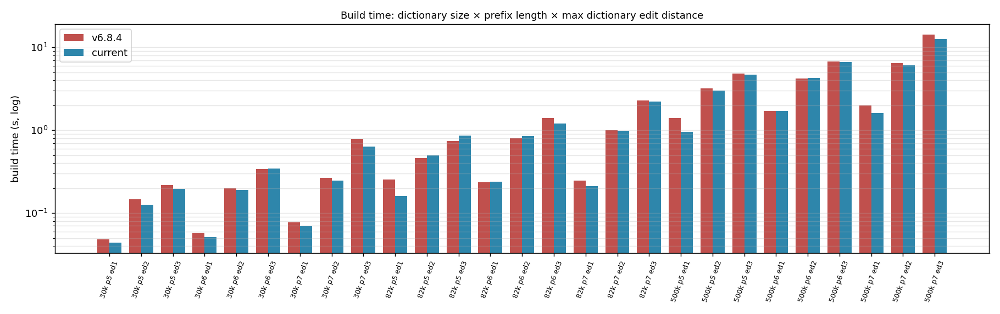

### Resident memory

| dictionary | prefix length | max dictionary edit distance | v6.8.4 | current | change |
|---|---:|---:|---:|---:|---:|
| 30,000 | 5 | 1 | 8.6 MiB | 6.5 MiB | -24% |
| 30,000 | 5 | 2 | 16.3 MiB | 9.4 MiB | -42% |
| 30,000 | 5 | 3 | 23.8 MiB | 12.2 MiB | -49% |
| 30,000 | 6 | 1 | 11.2 MiB | 8.8 MiB | -21% |
| 30,000 | 6 | 2 | 26.2 MiB | 16.9 MiB | -35% |
| 30,000 | 6 | 3 | 40.1 MiB | 22.1 MiB | -45% |
| 30,000 | 7 | 1 | 15.8 MiB | 13.1 MiB | -17% |
| 30,000 | 7 | 2 | 38.0 MiB | 26.4 MiB | -31% |
| 30,000 | 7 | 3 | 59.7 MiB | 34.3 MiB | -43% |
| 82,765 | 5 | 1 | 21.8 MiB | 16.6 MiB | -24% |
| 82,765 | 5 | 2 | 44.4 MiB | 24.9 MiB | -44% |
| 82,765 | 5 | 3 | 66.7 MiB | 33.2 MiB | -50% |
| 82,765 | 6 | 1 | 27.8 MiB | 21.4 MiB | -23% |
| 82,765 | 6 | 2 | 68.2 MiB | 41.3 MiB | -39% |
| 82,765 | 6 | 3 | 109.2 MiB | 56.3 MiB | -48% |
| 82,765 | 7 | 1 | 37.5 MiB | 30.1 MiB | -20% |
| 82,765 | 7 | 2 | 96.0 MiB | 61.8 MiB | -36% |
| 82,765 | 7 | 3 | 161.7 MiB | 85.4 MiB | -47% |
| 500,000 | 5 | 1 | 128.3 MiB | 91.7 MiB | -29% |
| 500,000 | 5 | 2 | 261.7 MiB | 141.3 MiB | -46% |
| 500,000 | 5 | 3 | 390.4 MiB | 189.1 MiB | -52% |
| 500,000 | 6 | 1 | 154.8 MiB | 111.6 MiB | -28% |
| 500,000 | 6 | 2 | 376.1 MiB | 214.0 MiB | -43% |
| 500,000 | 6 | 3 | 611.9 MiB | 300.5 MiB | -51% |
| 500,000 | 7 | 1 | 195.5 MiB | 147.1 MiB | -25% |
| 500,000 | 7 | 2 | 502.5 MiB | 300.8 MiB | -40% |
| 500,000 | 7 | 3 | 874.0 MiB | 435.7 MiB | -50% |

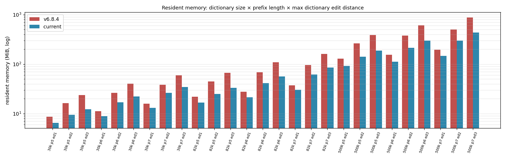

### Peak memory during build

| dictionary | prefix length | max dictionary edit distance | v6.8.4 | current | change |
|---|---:|---:|---:|---:|---:|
| 30,000 | 5 | 1 | 9.3 MiB | 7.3 MiB | -22% |
| 30,000 | 5 | 2 | 16.9 MiB | 10.1 MiB | -40% |
| 30,000 | 5 | 3 | 24.2 MiB | 12.9 MiB | -47% |
| 30,000 | 6 | 1 | 11.9 MiB | 9.6 MiB | -19% |
| 30,000 | 6 | 2 | 26.7 MiB | 18.2 MiB | -32% |
| 30,000 | 6 | 3 | 40.4 MiB | 22.6 MiB | -44% |
| 30,000 | 7 | 1 | 18.2 MiB | 16.0 MiB | -12% |
| 30,000 | 7 | 2 | 39.1 MiB | 31.5 MiB | -19% |
| 30,000 | 7 | 3 | 59.7 MiB | 34.8 MiB | -42% |
| 82,765 | 5 | 1 | 21.8 MiB | 16.6 MiB | -24% |
| 82,765 | 5 | 2 | 44.4 MiB | 24.9 MiB | -44% |
| 82,765 | 5 | 3 | 66.7 MiB | 33.2 MiB | -50% |
| 82,765 | 6 | 1 | 27.8 MiB | 21.4 MiB | -23% |
| 82,765 | 6 | 2 | 68.2 MiB | 41.3 MiB | -39% |
| 82,765 | 6 | 3 | 109.2 MiB | 56.3 MiB | -48% |
| 82,765 | 7 | 1 | 38.0 MiB | 32.7 MiB | -14% |
| 82,765 | 7 | 2 | 96.0 MiB | 65.6 MiB | -32% |
| 82,765 | 7 | 3 | 161.7 MiB | 85.4 MiB | -47% |
| 500,000 | 5 | 1 | 133.6 MiB | 101.0 MiB | -24% |
| 500,000 | 5 | 2 | 261.7 MiB | 146.2 MiB | -44% |
| 500,000 | 5 | 3 | 390.4 MiB | 189.1 MiB | -52% |
| 500,000 | 6 | 1 | 159.1 MiB | 120.6 MiB | -24% |
| 500,000 | 6 | 2 | 376.1 MiB | 225.0 MiB | -40% |
| 500,000 | 6 | 3 | 611.9 MiB | 302.4 MiB | -51% |
| 500,000 | 7 | 1 | 199.2 MiB | 155.9 MiB | -22% |
| 500,000 | 7 | 2 | 502.5 MiB | 305.8 MiB | -39% |
| 500,000 | 7 | 3 | 874.1 MiB | 435.7 MiB | -50% |

## Peak heap allocation during lookups

Peak heap allocation of a single lookup (tracking global allocator); lower is better. Ratio = current ÷ v6.8.4.

### 30,000-word dictionary

| max edit distance | prefix length | Top v6.8.4 | Top current | Closest v6.8.4 | Closest current | All v6.8.4 | All current |
|---:|---:|---:|---:|---:|---:|---:|---:|
| 1 | 5 | 5.5 KiB | 1.0 KiB (17%) | 8.0 KiB | 3.8 KiB (48%) | 8.0 KiB | 3.9 KiB (49%) |
| 1 | 6 | 5.5 KiB | 1.0 KiB (17%) | 8.0 KiB | 3.8 KiB (48%) | 8.0 KiB | 3.9 KiB (49%) |
| 1 | 7 | 5.5 KiB | 1.0 KiB (17%) | 8.0 KiB | 3.8 KiB (48%) | 8.0 KiB | 3.9 KiB (49%) |
| 2 | 5 | 42.1 KiB | 7.5 KiB (18%) | 47.2 KiB | 14.6 KiB (31%) | 62.9 KiB | 38.2 KiB (61%) |
| 2 | 6 | 21.6 KiB | 3.8 KiB (18%) | 31.4 KiB | 14.6 KiB (47%) | 63.1 KiB | 38.2 KiB (61%) |
| 2 | 7 | 21.6 KiB | 3.8 KiB (18%) | 31.4 KiB | 14.6 KiB (47%) | 63.1 KiB | 38.2 KiB (61%) |
| 3 | 5 | 166.7 KiB | 30.0 KiB (18%) | 169.0 KiB | 31.5 KiB (19%) | 497.1 KiB | 245.5 KiB (49%) |
| 3 | 6 | 86.0 KiB | 15.0 KiB (17%) | 88.6 KiB | 16.5 KiB (19%) | 416.3 KiB | 225.5 KiB (54%) |
| 3 | 7 | 46.8 KiB | 8.5 KiB (18%) | 49.4 KiB | 14.6 KiB (30%) | 293.8 KiB | 225.5 KiB (77%) |

### 82,765-word dictionary

| max edit distance | prefix length | Top v6.8.4 | Top current | Closest v6.8.4 | Closest current | All v6.8.4 | All current |
|---:|---:|---:|---:|---:|---:|---:|---:|
| 1 | 5 | 5.6 KiB | 1.0 KiB (17%) | 6.7 KiB | 3.3 KiB (49%) | 10.8 KiB | 4.0 KiB (37%) |
| 1 | 6 | 5.6 KiB | 1.0 KiB (17%) | 6.7 KiB | 3.3 KiB (49%) | 8.3 KiB | 4.0 KiB (48%) |
| 1 | 7 | 5.6 KiB | 1.0 KiB (17%) | 6.7 KiB | 3.3 KiB (49%) | 8.3 KiB | 4.0 KiB (48%) |
| 2 | 5 | 83.5 KiB | 15.0 KiB (18%) | 86.0 KiB | 16.5 KiB (19%) | 125.0 KiB | 67.8 KiB (54%) |
| 2 | 6 | 22.5 KiB | 3.8 KiB (17%) | 26.9 KiB | 10.2 KiB (38%) | 125.3 KiB | 67.8 KiB (54%) |
| 2 | 7 | 22.0 KiB | 3.8 KiB (17%) | 27.0 KiB | 10.2 KiB (38%) | 125.3 KiB | 67.8 KiB (54%) |
| 3 | 5 | 332.3 KiB | 60.0 KiB (18%) | 334.3 KiB | 61.5 KiB (18%) | 1.45 MiB | 493.5 KiB (33%) |
| 3 | 6 | 168.1 KiB | 30.0 KiB (18%) | 170.7 KiB | 31.5 KiB (18%) | 834.0 KiB | 453.5 KiB (54%) |
| 3 | 7 | 88.0 KiB | 16.0 KiB (18%) | 90.2 KiB | 17.5 KiB (19%) | 833.0 KiB | 453.5 KiB (54%) |

### 500,000-word dictionary

| max edit distance | prefix length | Top v6.8.4 | Top current | Closest v6.8.4 | Closest current | All v6.8.4 | All current |
|---:|---:|---:|---:|---:|---:|---:|---:|
| 1 | 5 | 11.0 KiB | 1.9 KiB (17%) | 18.5 KiB | 13.5 KiB (73%) | 42.3 KiB | 15.9 KiB (37%) |
| 1 | 6 | 10.9 KiB | 1.9 KiB (17%) | 18.5 KiB | 13.5 KiB (73%) | 31.3 KiB | 15.9 KiB (51%) |
| 1 | 7 | 10.9 KiB | 1.9 KiB (17%) | 18.5 KiB | 13.5 KiB (73%) | 31.3 KiB | 15.9 KiB (51%) |
| 2 | 5 | 329.8 KiB | 60.0 KiB (18%) | 332.4 KiB | 61.5 KiB (19%) | 992.1 KiB | 484.6 KiB (49%) |
| 2 | 6 | 85.4 KiB | 15.0 KiB (18%) | 89.1 KiB | 22.5 KiB (25%) | 992.1 KiB | 484.6 KiB (49%) |
| 2 | 7 | 83.5 KiB | 15.0 KiB (18%) | 94.0 KiB | 22.5 KiB (24%) | 992.1 KiB | 484.6 KiB (49%) |
| 3 | 5 | 2.58 MiB | 480.0 KiB (18%) | 2.58 MiB | 486.0 KiB (18%) | 7.76 MiB | 3.89 MiB (50%) |
| 3 | 6 | 666.0 KiB | 120.0 KiB (18%) | 668.7 KiB | 123.0 KiB (18%) | 6.49 MiB | 3.57 MiB (55%) |
| 3 | 7 | 335.2 KiB | 61.0 KiB (18%) | 340.6 KiB | 64.0 KiB (19%) | 4.61 MiB | 3.57 MiB (77%) |

## Notes

- Each lookup experiment is a short run, so single cells can be noisy; the trend is consistent across all 81 experiments.
